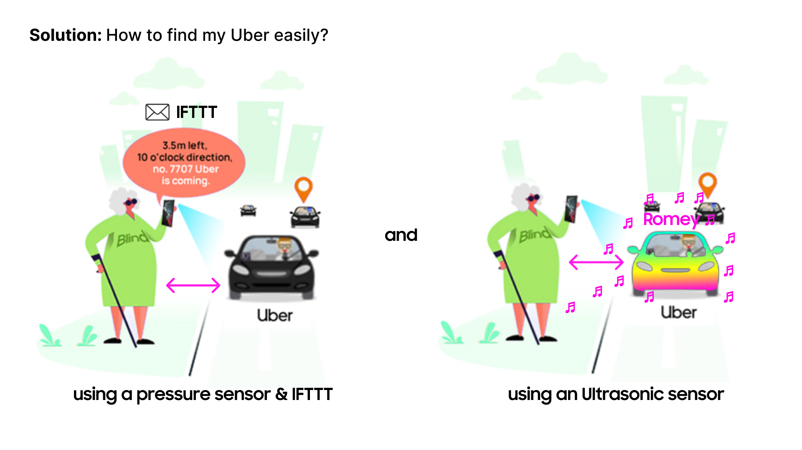

# FINAL PROJECT: How to easily find my Uber
## Introduction
It is not easy to find the Uber I called or find my own vehicle in very crowded places such as LAX or large shopping malls.
Moreover, if I have low vision or am a traveler, it will be even more difficult to find my vehicle.

So, I created a way to communicate with the vehicle (Monitor) using ultrasonic sensors and pressure sensors as remote control to more easily find and find the Uber I called.

So, when the Uber I called comes near me, I put my phone in the remote control holder that contains the pressure sensor. Afterwards, when I get close to the vehicle, the Ultrasonic sensor measures the distance, and the music gets louder and louder in my Uber vehicle (Monitor) (and the colors I choose change and are expressed along with the sound), it making it easier to find my Uber for me. 

From Now on, you can find easier your Uber too.

##
## Implementation
### Hardware - material & wiring
I used:

- 1 Atom s3 lite board
- 1 Ultrasonic sensor
- 1 Pressure sensor

